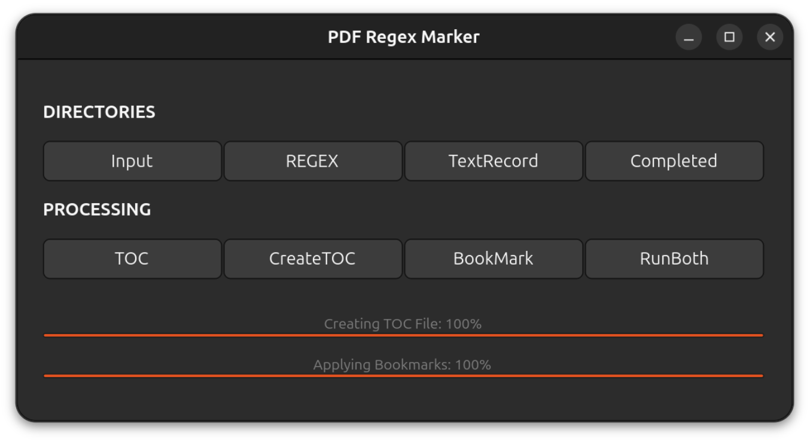
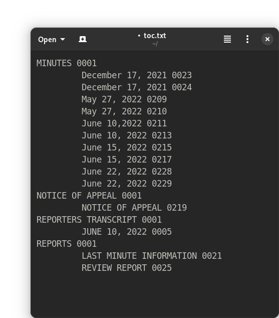
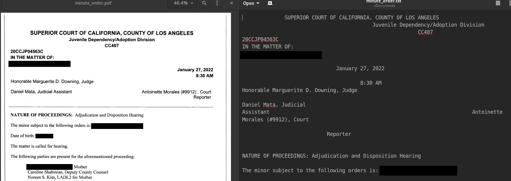

# PDF Regex Marker
PDF Regex Marker is an application for automatically bookmarking large pdf documents by using [regular expressions](https://en.wikipedia.org/wiki/Regular_expression) to match desired patterns. It was designed to bookmark legal transcripts, but there may be other uses. The user must supply a pdf file, or files, that already have embedded text (through [OCR](https://en.wikipedia.org/wiki/Optical_character_recognition) or generated from a word processor), as well as separately-named text files that include the desired regular expressions. PDF Regex Marker first creates a separate text file for each page of the pdf document and sequentially numbers those pages. The application then runs each regular expression against each text file, and creates a table of contents file (TOC file) based on the resulting matches. Finally, the application uses the TOC file to apply bookmarks to the original pdf document. The bookmarks are categorized based on the name given to each text file containing regular expressions. After an initial run, the user can manually make corrections or additions to the TOC file, then apply the bookmarks (the "redo" option).

PDF Regex Marker is written in Python, has a GTK4 GUI, and only works on linux. It relies on Ghostscript, which is preinstalled on most linux distributions. It also relies on the following python modules that can be installed via the requirements file:

* click
* pdftotext
* PyPDF4

PDF Regex Marker was inspired by [splittotext](https://github.com/kampji/splittotext), and makes heavy use of [pdfoutline](https://github.com/yutayamamoto/pdfoutline).



# Installation
Place files in home directory

	git clone https://github.com/jessemcg/pdf-regex-marker.git

Ensure that the python files are executable

	chmod +x -R $HOME/pdf-regex-marker

Install python modules not in standard library

	pip install -r $HOME/pdf-regex-marker/requirements.txt

Run the "pdf_marker.py" file

	python $HOME/pdf-regex-marker/pdf_marker.py

Or place the above command in a script launching app like [Launcher](https://extensions.gnome.org/extension/5874/launcher/).
   
# Usage

To test right away, simply press run. The input folder and regex folder already have some simple content for testing. See below for further background.

## The Input Folder

The input folder is where you place the large pdf file that already contains embedded text. You can also place multiple pdf files in this folder that are numbered sequentially (if number is double-digits, pad single digit numbers with a leading zero). PDF Regex Marker will combine those files into one large pdf document before moving on to the next step. This is useful if your normal practice is to divide a large record into smaller portions for OCR processing.

## The Regex Folder

The regex folder is where you place the text files that contain your regular expressions. The name of each text file will be the name of a category (or level) of bookmarks, with each match from that text file falling under that category name. Within each text file, each regular expression can be separated by a blank line for clarity.

## The Text File Folder

The text file folder will -- after pressing "run" -- contain a separate text file for each page of the larger pdf document. The point of this folder is to allow the user to develop better regular expressions. For example, if you thought that a given regular expression was going to match a specific phrase but failed to do so, you can go to the specific text file and paste the contents into a web site like [regex101.com](https://regex101.com/) or use an app that does a similar thing. From there, you can test your regular expression to see what the problem was.

## The TOC File and Redo Option

Thanks to [pdfoutline](https://github.com/yutayamamoto/pdfoutline), the TOC file is easy to read and edit. It's just a list of the categories with each bookmark and page number indented underneath it.

As mentioned above, after an initial run, you can manually edit the TOC file, then press "redo" to apply the edited TOC file to a new pdf named "redo_completed_record.pdf." This is a useful feature because even a very good set of regular expressions can sometimes fail to match phrases or apply unexpected matches.



## Developing a Good Set of Regular Expressions

The usefulness of PDF Regex Marker will depend on how good your regular expressions are. This requires learning the [syntax](https://www.dataquest.io/wp-content/uploads/2019/03/python-regular-expressions-cheat-sheet.pdf), and unfortunately, some trial and error. The goal should be to create regular expressions that are broad enough to match patterns or phrases over a wide array of documents, but specific enough to exclude irrelevant phrases. Consult GPT-4 for assistance.

Here is one example. The following is the first page of a minute order with the corresponding text file. The goal will be to match the date.



This is the regular expression used to match the date:

```
(January|February|March|April|May|June|July|August|September|October|November|December)(\s?\d{1,2},\s?\d{4})(?=|.*\n.*8:30\s+?AM\n.*Hon|\n.*8:30\s?AM\n.*Hon)
```

* The patterns in the first two parentheses are capturing groups, meaning that what they match will actually show up in our program.
* The "|" symbol basically means "or." Therefore, "January|February|March" and so on will match any month.
* In the second capturing group, "\s?" means one space or no space. "\d{1,2}" means one or two digits. "\d{4}" means four digits. Thus, the sequence will match the day and year (whatever those may be).
* The third parenthesis that starts with "?=" is a look-a-head non-capturing group. The computer looks ahead of the capturing groups to see if there is also a match for this non-capturing group. This is how we can ensure that only dates from the first page of a minute order will be returned, and not every date in the entire pdf.
* ".*" means any character any number of times. "\n" means new line. ".*8:30\s+?AM" matches the time 8:30 AM. "\n.*Hon" denotes another new line followed by any number of characters followed by "Hon." Thus, the non-capturing group is designed to identify something unique in the first page of each minute order, which is that the date is closely followed by a specific time (8:30) and Honorable ... I could have included the entire word "Honorable" but "Hon" made it specific enough. Use [regex101.com](https://regex101.com/) to test regular expressions and learn more details about what each symbol means.
* Sometimes there will be minor deviations either from the OCR process or the text extraction process. In the above minute order, for example, I learned that there are sometimes empty characters right after the date but before the new line starts, and sometimes the new line starts right away. We can deal with this by using the "|" symbol to include two versions of a non-capturing group; one that starts with ".*" and one that does not.
